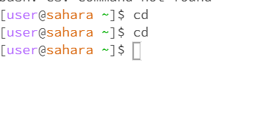
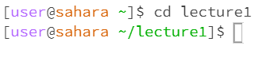
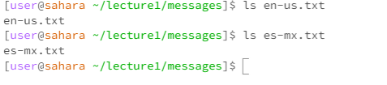
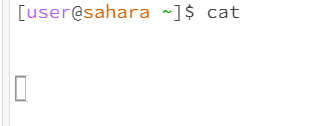
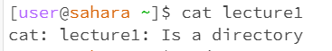
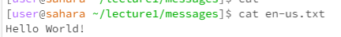

# Lab Report1
**> Blockquote**

`Command 1: Cd (Change Directory)`

*Example 1: Using cd with No Arguments
Command: `cd`

Working Directory: `/home`

Output: No output (successful command)

Explanation: When you use cd with no arguments, it takes you to your home directory. This is why you see no output, indicating success.

*Example 2: Using cd with a Directory Path

Command: `cd lecture1`

Working Directory: `/home`

Output: No output (successful command)

Explanation: Here, we specify a directory path as an argument, and the cd command takes us to that directory, as long as it exists. No output indicates success.

Example 3: Using cd with a File Path

Command: `cd en-us.txt`

Working Directory: `/home/lecture1/messages`

Output: file can not be working directory.

---

`Command 2 : ls (List)`
*Example 1: Using ls with No Arguments

Command: `ls`

Working Directory: `/home`

Output: List of files and subdirectories in the current directory

Explanation: ls with no arguments lists the contents of your current directory. It helps you view what's inside your working directory.

*Example 2: Using ls with a Directory Path

Command: `ls lecture1`

Working Directory: `/home`

Output: List of files and subdirectories in the specified directory

Explanation: When you provide a directory path as an argument to ls, it lists the contents of that directory, regardless of your current working directory.

*Example 3: Using ls with a File Path

Command: `ls en-us.txt`

Working Directory: `/home/lecture1/messages`

Output: error

Explanation: This command is an error because ls is intended to list the contents of directories, not individual files.

---

`Command 3: cat (Concatenate)`   

*Example 1: Using cat with No Arguments

Command: `cat`

Working Directory: `/home`

Output: Outputs the content of the file if you provide input via the terminal, otherwise it waits for input.

Explanation: cat without arguments waits for input from the user. It is used for viewing and concatenating file content.

*Example 2: Using cat with a Directory Path

Command: `cat lecture1`

Working Directory: `/home`

Output: Error Lecture1 is a directory

Explanation: cat expects a file path as an argument. Providing a directory path results in an error because you cannot concatenate the content of a directory.

*Example 3: Using cat with a File Path

Command: `cat en-us.txt`

Working Directory: `/home/lecture1/messages`

Output: Displays the content of the specified file

Explanation: When you provide a file path as an argument, cat displays the content of that file. It's a useful command for reading the contents of files.
