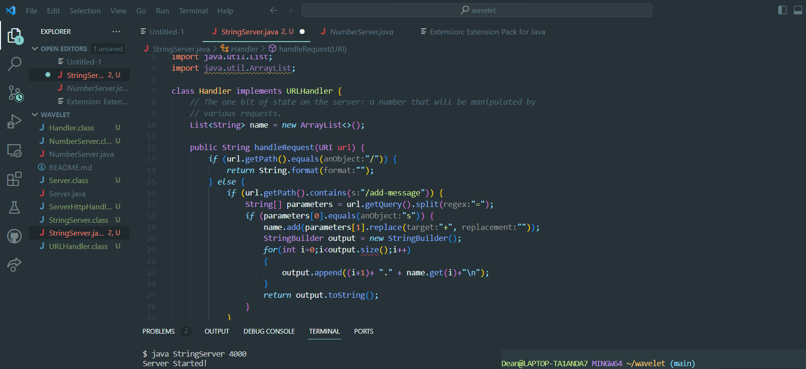
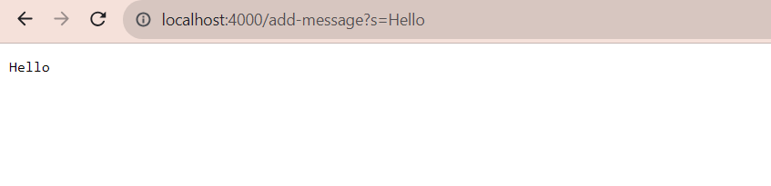
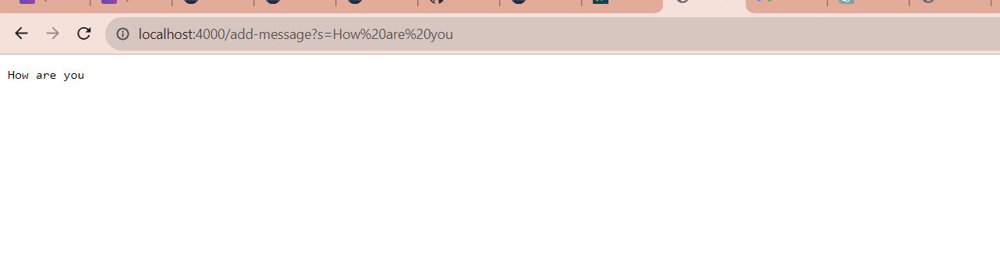
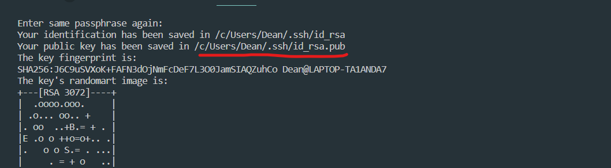

# Lab-Report2

`part1: Write a webserver called StringServer`

1. Code for StringServer Image

2. two screenshots of using /add-message

- Add Hello

- Add How are you

---

`part2: Using the command line, show with ls and take screenshots of`

1. Public Key

2. Private Key
- I was trying to do this part. but I couldn't.. could you explain me about this part? how to get the private key. thank you. I will revise my lab report with the advice.

---

`Part3: What I learned`

- During this learning experience, I acquired the knowledge of accessing ieng6 servers. I also learned how to run a server on my own computer and access websites via the new server port. For instance, after running Java and initiating the server, I can simply open a web browser on my computer and visit http://localhost:4000.
Additionally, I gained insight into downloading and using Visual Studio to connect to the server efficiently.
