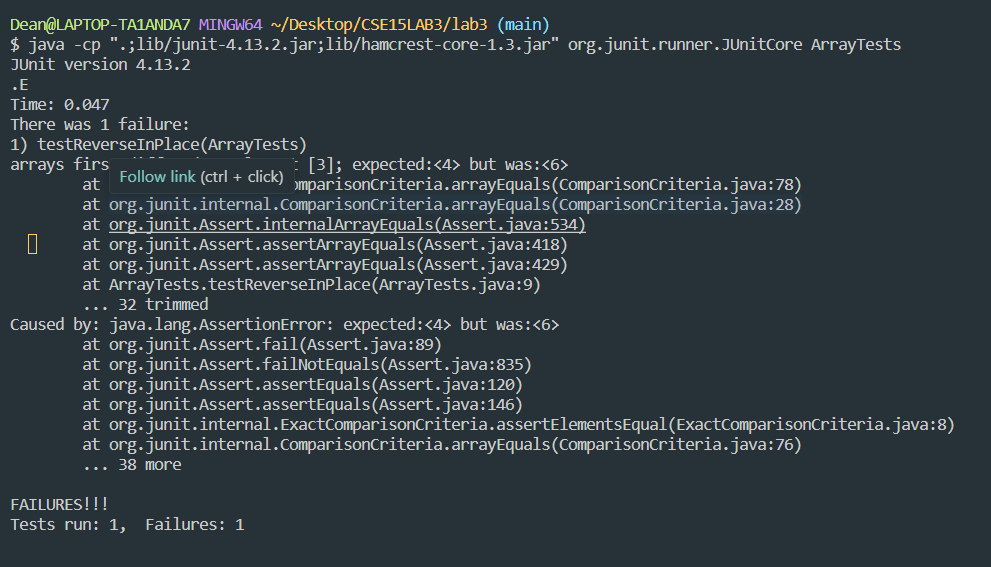
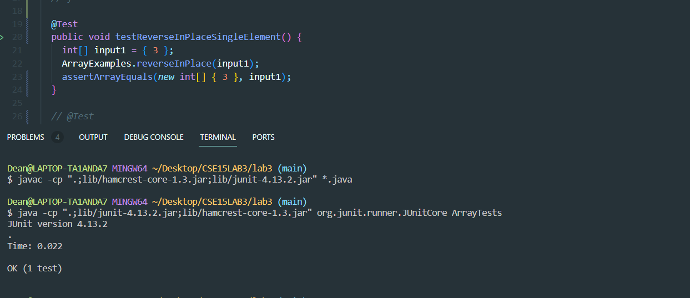

# Lab-Report3

**part1: Bugs**

1. A failure-inducing input for the buggy program, as a JUnit test and any associated code
   
`int[] input1 = { 3, 4, 5, 6, 7 };`

`expected value: 7,6,5,4,3`

2. An input that doesn’t induce a failure, as a JUnit test and any associated code

`int[] input1 = { 3 };`

`expected value: 3`

3. The symptome: The reverseInPlace method did not reverse the array as expected. Instead, it resulted in unexpected behavior, possibly due to incorrect logic within the method.

4. - failure-inducing input


- input that doesn’t induce a failure
   

5. The bug, as the before-and-after code change required to fix it

- bug, as the before change
```
  static void reverseInPlace(int[] arr) {
    for(int i = 0; i < arr.length; i += 1) {
      arr[i] = arr[arr.length - i - 1];
    }
  }
```
- after code change required to fix it:

```
static void reverseInPlace(int[] arr) {
    for (int i = 0; i < arr.length / 2; i += 1) {
      int temp = arr[i];
      arr[i] = arr[arr.length - i - 1];
      arr[arr.length - i - 1] = temp;
    }
  }

```
I added the int temp to reversed numbers in array list.
a single loop iterates through half of the array's length, and it swaps elements from the beginning and end of the array. This logic effectively reverses the array in place, providing the correct solution to the issue.

---

`part2:  Researching Commands`

'grep'

- The grep command allows you to search one file or multiple files for lines that contain a patter. Exit status is 0 if matches were found, 1 if no matches were found, and 2 if errors occurred.

1. The 'grep' command: Option -i

   - When searching igonre uppercase vs lowercase.

   - Useful: This Searches for the given string/pattern case insensitively. so it masthces all the words insensitiely as shown below.

```
Dean@LAPTOP-TA1ANDA7 MINGW64 ~/docsearch (main)
$ grep -i "Korea" technical/*/*.txt
technical/911report/chapter-11.txt:                in Korea another. But these were attacks by major powers. While by no means as
technical/911report/chapter-11.txt:                the main focus (war in Korea), and as too unrealistic. As we pointed out in chapter
technical/911report/chapter-12.txt:                not experienced such a rapid surge in national security spending since the Korean
technical/911report/chapter-13.4.txt:                Khallad, Aug. 13, 2003; Apr. 5, 2004. According to Khallad, Thailand, South Korea,
technical/911report/chapter-5.txt:                Singapore, or Korea.) This part of the operation has been confirmed by Khallad, who
technical/911report/chapter-5.txt:                Thailand, South Korea, Hong Kong, or Malaysia, and using Yemenis who would not need
technical/911report/chapter-6.txt:                emphasized other issues such as North Korea and the Israeli- Palestinian peace
technical/911report/chapter-6.txt:                with the faltering Middle East peace process and North Korea. Clarke said that the
technical/biomed/1471-2148-2-17.txt:          Korea, and was previously considered a species of subg. 
technical/biomed/1471-2148-2-17.txt:          Europe and the Far East in Manchuria, Korea, and Japan.
technical/biomed/1471-2156-3-11.txt:          from SeeGene (Seoul, Korea). The 
technical/biomed/1472-6823-2-2.txt:          Jolla, CA; Sofia, Bulgaria; Seoul, South Korea and São
technical/biomed/1472-6823-2-2.txt:          Brazil; The Catholic University of Korea, Seoul, South
technical/biomed/1472-6823-2-2.txt:          Korea). No information that would identify the subjects
technical/biomed/1472-6920-2-3.txt:        South Korea [ 5 ] and for a Turkish medical school [ 6 ] .
technical/plos/journal.pbio.0020121.txt:        imported cases in the Republic of Korea, but surveillance has not been thorough in North

```

I got all words include "Korea"

2.  Example 2: "Design"

```

Dean@LAPTOP-TA1ANDA7 MINGW64 ~/docsearch (main)
$ grep -i "Design" technical/*/*.txt

technical/biomed/1471-2474-2-1.txt:        Assuming an unmatched case control design with alpha = 0.05
technical/biomed/1471-2474-2-1.txt:        prophylaxis, an unmatched case-control study design was
technical/biomed/1471-2474-2-1.txt:        employed. This type of study design has the advantage of
technical/biomed/1471-2474-2-2.txt:          primers (Table 1) designed for osteocalcin, type I
technical/biomed/1471-2474-2-2.txt:          group respectively. The experiment was designed to have
technical/biomed/1471-2474-2-2.txt:          the four rats designated for study at 6 weeks after
technical/biomed/1471-2474-3-23.txt:        Various designs of interbody fusion cages have been
technical/biomed/1471-2474-3-23.txt:        dependent on the design of the cage. The single large
technical/biomed/1471-2474-3-23.txt:        cage design. In a study on calf and pig spine, two
technical/biomed/1471-2474-3-23.txt:        potential of the three cage designs, but the cylindrical
technical/biomed/1471-2474-3-23.txt:        cylindrical cages are designed to engage into the
technical/biomed/1471-2474-3-23.txt:        smooth surface, designed to fit the endplate contours.
technical/biomed/1471-2474-3-23.txt:        stability in lumbar spine after fixation with a new design
technical/biomed/1471-2474-3-23.txt:          The rectangular cage design
technical/biomed/1471-2474-3-23.txt:          The newly designed rectangular cage (Fig 1) (made by
technical/biomed/1471-2474-3-23.txt:          rectangular design to restore the lumbar lordosis. The
technical/biomed/1471-2474-3-23.txt:          designed to engage into the endplate to provide

```
- There are more results. I typed "Design", which finds instances of "design" because it ignores upper / lower cases.

---
2. The 'grep' command: Option -b

- Display the block number at the beginning of each line.

- Useful: -b is the option which prints the specified N lines before the match. When doing a grep on a huge file, it may be useful to see some lines after the match.

Example 1: "ucsd"
```

`$ grep -b "ucsd" technical/*/*.txt`
technical/biomed/1471-2121-2-22.txt:10005:        http://ncmir.ucsd.edu/~perkins/tBid. For example, it became
technical/biomed/1471-2164-3-18.txt:39874:          http://genome.ucsd.edu/index.html [ 54 55 ] . The

```
- 10005 and 39874 is the block number at the beggining of each line.

Example 2: "South Korea"
```
`$ grep -b "South Korea" technical/*/*.txt`
technical/911report/chapter-13.4.txt:35297:                Khallad, Aug. 13, 2003; Apr. 5, 2004. According to Khallad, Thailand, South Korea,
technical/911report/chapter-5.txt:38494:                Thailand, South Korea, Hong Kong, or Malaysia, and using Yemenis who would not need
technical/biomed/1472-6823-2-2.txt:4416:          Jolla, CA; Sofia, Bulgaria; Seoul, South Korea and São
technical/biomed/1472-6920-2-3.txt:426:        South Korea [ 5 ] and for a Turkish medical school [ 6 ] .
```
-The numbers are the block numbers [35297,38494,4416,426].

---
3. The 'grep' command: Option -w

- Display matching whole word.

- Useful: searching for whole word, so I can find only typing word will show out all the lines eventhought the word is normal.

`Example 1: realistic will show only realistic not unrealistic.'

```
`$ grep -w "realistic" technical/*/*.txt`

technical/911report/chapter-12.txt:                    best. They should expect that officials will have realistic objectives, clear
technical/911report/chapter-12.txt:                    actual or potential terrorist sanctuaries. For each, it should have a realistic
technical/911report/chapter-12.txt:                    aggressive and realistic training in accordance with ICS and unified command
technical/biomed/1471-2105-2-8.txt:          introducing realistic flexibility is that we have
technical/biomed/1471-2105-2-8.txt:          realistic scenario for QRNA; a BLASTN primary sequence
technical/biomed/1471-2105-2-8.txt:          To test QRNA performance in a realistic whole genome
technical/biomed/1471-2105-3-14.txt:        efficiently on realistic data sets, though it has an
technical/biomed/1471-2105-4-26.txt:          realistic goal, say, to detect genes with effect size ≥
technical/biomed/1471-2164-3-27.txt:          represent a more realistic assessment of the underlying
technical/biomed/1471-2164-4-4.txt:        detected in a realistic experiment.
technical/biomed/1471-2253-2-5.txt:        is based on the use of a physiologically realistic model of
technical/biomed/1471-2288-3-8.txt:          a realistic value for ψ
technical/biomed/1471-2288-3-8.txt:        realistic lower bound for ψ 
technical/biomed/1471-2288-3-9.txt:          example, but is probably not realistic. Even interpreting
technical/biomed/1471-2288-3-9.txt:          never realistic. The next step in improving these
technical/biomed/1471-2288-3-9.txt:          realistic values, is absent. Furthermore, the intuition
```

Example 2: "fbi"
```
`$ grep -w "fbi" technical/*/*.txt`
technical/911report/chapter-13.3.txt:                FBI" (online at www.fbi.gov/libref/historic/history/historymain.htm); the FBI's
technical/911report/chapter-13.3.txt:                updated June 18, 2003 (online at www.fas.org/irp/agency/doj/fbi/fbi_hist.htm). For
```
---

4.The 'grep' command: Option -c

- want to count that how many lines matches the given pattern/string, then use the option -c.

Example 1: 
```
`$ grep -c "go" technical/*/*.txt`

technical/biomed/1471-2121-3-22.txt:2
technical/biomed/1471-2121-3-25.txt:15
technical/biomed/1471-2121-3-30.txt:20
technical/biomed/1471-2121-3-4.txt:6
technical/biomed/1471-2121-3-6.txt:9
technical/biomed/1471-2121-3-8.txt:6
technical/biomed/1471-2121-4-1.txt:3
technical/biomed/1471-2121-4-2.txt:3
technical/biomed/1471-2121-4-3.txt:4
technical/biomed/1471-2121-4-4.txt:1
technical/biomed/1471-2121-4-5.txt:1
technical/biomed/1471-2121-4-6.txt:3
technical/biomed/1471-213X-1-1.txt:3
technical/biomed/1471-213X-1-10.txt:8
technical/biomed/1471-213X-1-11.txt:6
technical/biomed/1471-213X-1-12.txt:4
technical/biomed/1471-213X-1-13.txt:11
technical/biomed/1471-213X-1-15.txt:9
technical/biomed/1471-213X-1-2.txt:6
technical/biomed/1471-213X-1-3.txt:0
technical/biomed/1471-213X-1-4.txt:4
technical/biomed/1471-213X-1-6.txt:4
```
- show how many lines matches the given 'go'.

Example2 :
```
`$ grep -c "realistic" technical/*/*.txt`

technical/plos/pmed.0020206.txt:0
technical/plos/pmed.0020208.txt:0
technical/plos/pmed.0020209.txt:0
technical/plos/pmed.0020210.txt:0
technical/plos/pmed.0020212.txt:0
technical/plos/pmed.0020216.txt:0
technical/plos/pmed.0020226.txt:0
technical/plos/pmed.0020231.txt:0
technical/plos/pmed.0020232.txt:0
technical/plos/pmed.0020235.txt:0
technical/plos/pmed.0020236.txt:0
technical/plos/pmed.0020237.txt:0
technical/plos/pmed.0020238.txt:0
technical/plos/pmed.0020239.txt:3
technical/plos/pmed.0020242.txt:0
technical/plos/pmed.0020246.txt:0
technical/plos/pmed.0020247.txt:0
technical/plos/pmed.0020249.txt:11
technical/plos/pmed.0020257.txt:0
technical/plos/pmed.0020258.txt:1
technical/plos/pmed.0020268.txt:0
technical/plos/pmed.0020272.txt:1
technical/plos/pmed.0020273.txt:0
```
