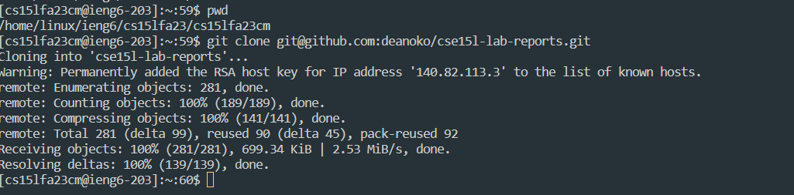

# Lab-Report4 - vim

`part1: Write a webserver called StringServer`

1. Log into ieng6

2. Clone your fork of the repository from your Github account (using the SSH URL).

3. Run the tests, demonstrating that they fail.

4. Edit the code file ListExamples.java to fix the failing test (as a reminder, the error in the code is just that index1 is used instead of index2 in the final loop in merge).

6. Run the tests, demonstrating that they now succeed.

7. Commit and push the resulting change to your Github account.

---

`part2: Using the command line, show with ls and take screenshots of`

---
