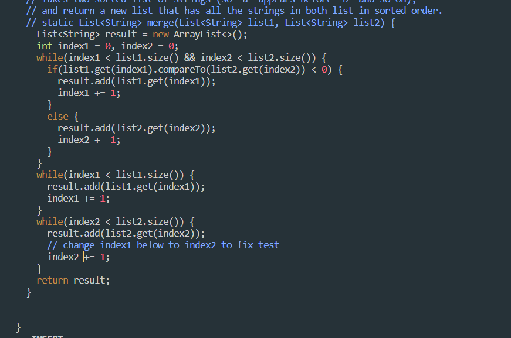

# Lab-Report4 - vim

`part1: Write a webserver called StringServer`

1. Log into ieng6

- after type in the ieng6 Id press the 'ssh cs15lfa23m@ieng6.ucsd.edu <enter>`

2. Clone your fork of the repository from your Github account (using the SSH URL).

-  `git clone <Ctrl><V><enter>`

3. Run the tests, demonstrating that they fail.

- cd lab7 and then press the `bash test.sh` to run the tests.

- Failed message

4. Edit the code file ListExamples.java to fix the failing test (as a reminder, the error in the code is just that index1 is used instead of index2 in the final loop in merge).

- to fix the code from file ListExamples.java, press `vim ListExamples.java` and `<Enter>`.

- 'Fix code on the Vim'

- press 'i' to insert word. after fixing the error code, press `esc` and then press `:wq` to exit with save.

5. Run the tests, demonstrating that they now succeed.

6. Commit and push the resulting change to your Github account.

- press `git add ListExamples.java` and then type in the fix code after typing in the git commit.

 

---

