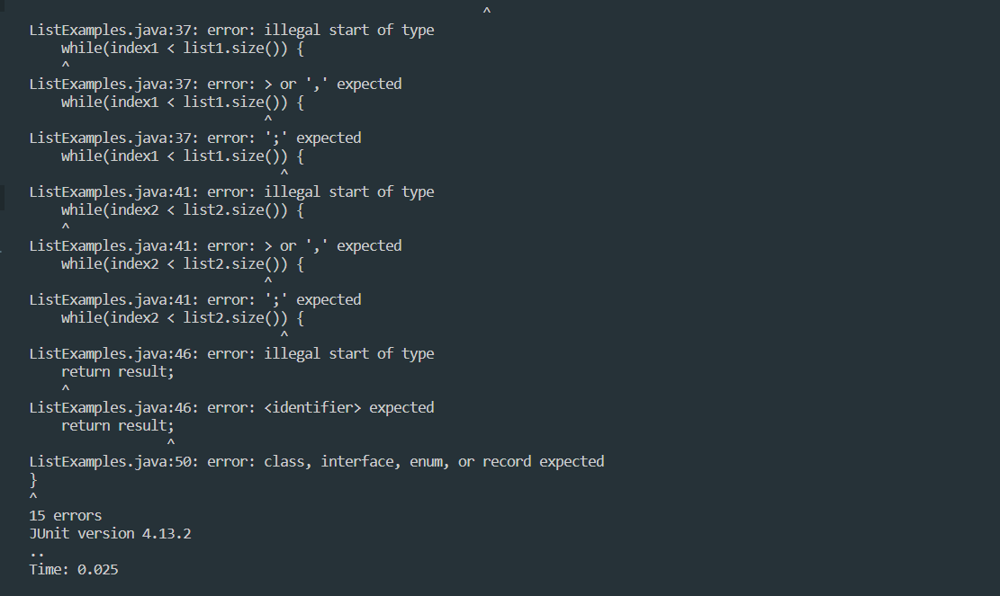
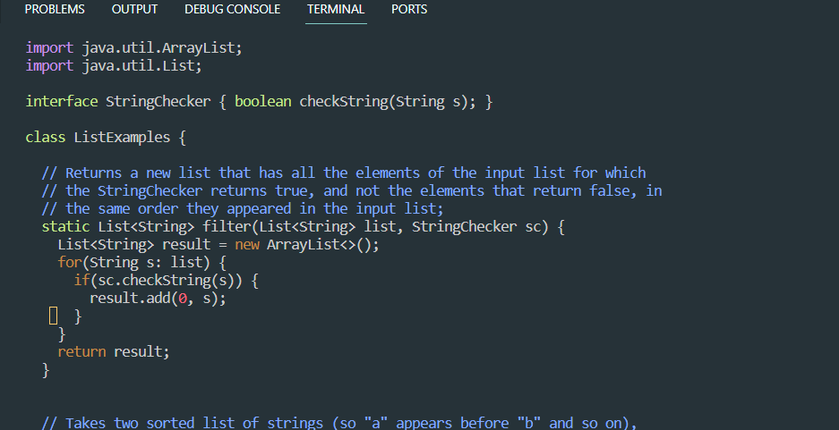
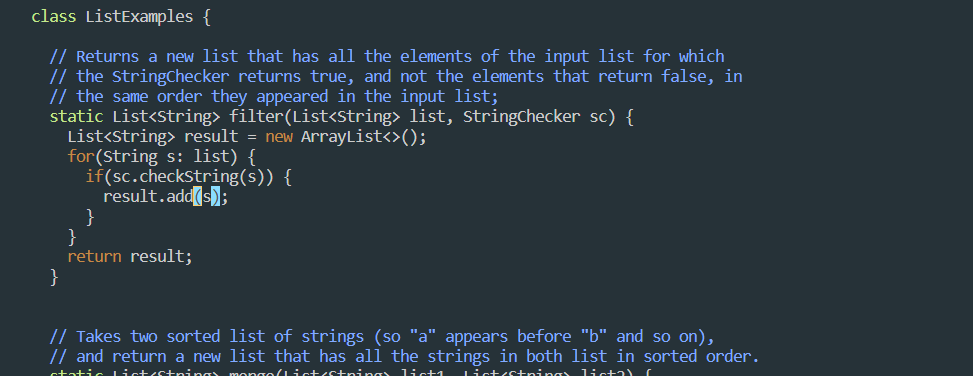
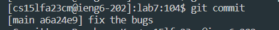

# Lab-Report4 - vim

`part1: Write a webserver called StringServer`

1. Log into ieng6

- `ssh cs15lfa23m@ieng6.ucsd.edu <enter>`

2. Clone your fork of the repository from your Github account (using the SSH URL).

-  `git clone <Ctrl> <V> <enter>`

3. Run the tests, demonstrating that they fail.

- `cd lab7` `bash test.sh`
  
- Failed message
  

4. Edit the code file ListExamples.java to fix the failing test (as a reminder, the error in the code is just that index1 is used instead of index2 in the final loop in merge).

- `vim ListExamples.java <Enter>`
  

- 'Fix Problem1'
  

`<down><down><down><down><down><down><down><down><down><down><down><down><down><down><right><right><right><right><right><right><right><right><right><right><right><right><right><right><right><right><right><right><right><right> i <backspace><backspace><backspace><esc>`

- `Fix Problem2`

`<down><down><down><down><down><down><down><down><down><down><down><down><down><down><down><down><down><down><down><down><down><down><down><down><down><down><down><down><down><right><right><right><right><right><right><right><right><right><right><right><right> <i> <backspace> <2><esc>`

- to exit from vim: `:wq<enter>`

5. Run the tests, demonstrating that they now succeed.

`bash test.sh`

6. Commit and push the resulting change to your Github account.

`<git add ListExamples.java> <enter> git commit <enter> fixcode <enter>`

 

---

