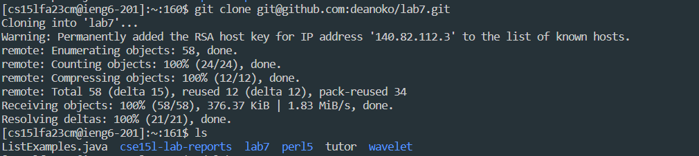
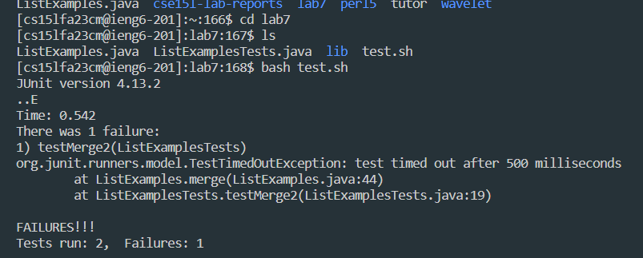
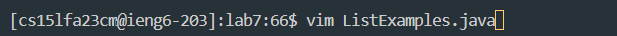
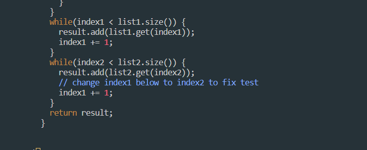
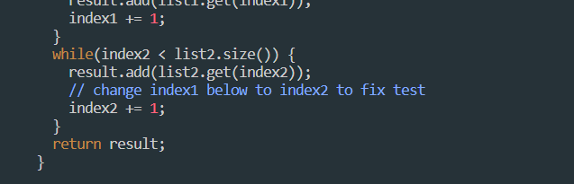
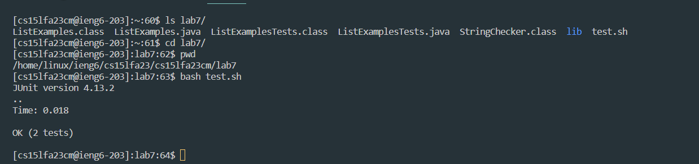
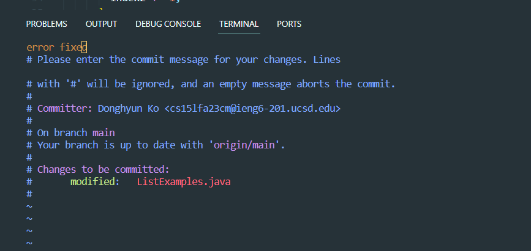
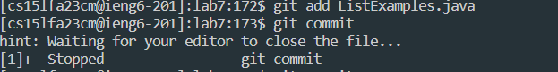
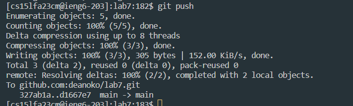
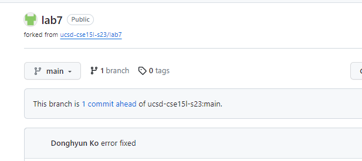

# Lab-Report4 - vim

`part1: Write a webserver called StringServer`

1. Log into ieng6

- `ssh cs15lfa23m@ieng6.ucsd.edu <enter>`

2. Clone your fork of the repository from your Github account (using the SSH URL).

-  `git clone <Ctrl> <V> <enter>`

-  Ctrl+V is git@github.com:deanoko/lab7.git

3. Run the tests, demonstrating that they fail.

- `cd lab7 <enter> bash test.sh <enter>`
  
- `cd lab7` means changing directory to lab7
  
- `bash test.sh` means that compile and run the program.
  
- Failed message
  

4. Edit the code file ListExamples.java to fix the failing test (as a reminder, the error in the code is just that index1 is used instead of index2 in the final loop in merge).

- `vim ListExamples.java <Enter>`
  

- `Fix The Problem`

`<down><down><down><down><down><down><down><down><down><down><down><down><down><down><down><down><down><down><down><down><down><down><down><down><down><down><down><down><down><down><down><down><down><down><down><down><down><down><down><down><down><down><down><right><right><right><right><right><right><right><right><right><right><right><right> <i> <backspace> <2> <esc>`

- The line that have error is located in 44 rows, which made me press down 43 times.

- Press the <i> to revise the code and press the <backspace> 1 times to delete the wrong code and then type in the 2.

- after fixing the code, press the <esc> to end revising the code.

- to exit from vim: `:wq <enter>`

- meaning :wq is that exit with save from vim.
  
5. Run the tests, demonstrating that they now succeed.

`bash test.sh <enter>`

- `bash test.sh` means that compile and run the program. Now confirmed working properly.

6. Commit and push the resulting change to your Github account.

`<git add ListExamples.java> <enter> git commit <enter> error fixed <:wq> <enter> git push <enter>`

- `<git add>` : made changes to a file called ListExamples.java and you want to stage those changes.

- `<git commit>` : git commit command is used to save the changes I have made to the repository

- `<git push>` : the command is used to upload your local branch and its commits to a remote repository. 
 

 

---

