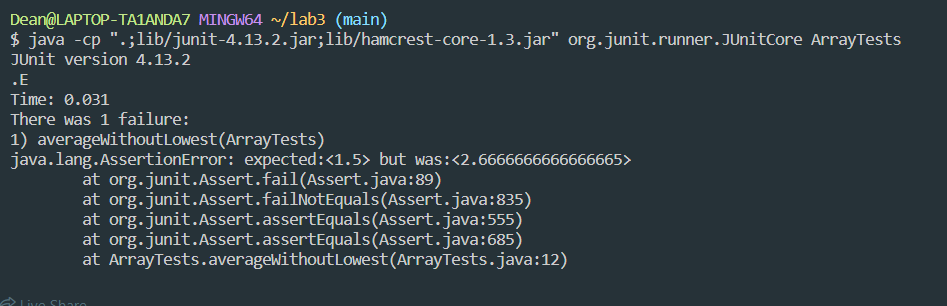

# Lab-Report5 - Putting it All Together

`part1: Debugging Scenario`

`1. Subject: Issue with my Java Program`

```
Hi,

I'm having trouble with my Java program, and I can't figure out what's going wrong. I've attached a screenshot that shows the issue. When I run my program, it gives this weird output, and I can't understand why. I've checked my code, and it seems fine to me.
```

```
Error Code :
public class ArrayExamples {

 // Averages the numbers in the array (takes the mean), but leaves out the
 // lowest number when calculating. Returns 0 if there are no elements or just
 // 1 element in the array
  static double averageWithoutLowest(double[] arr) {
  if(arr.length < 2) { return 0.0; }
  double lowest = arr[0];
  for(double num: arr) {
    if(num < lowest) { lowest = num; }
    }
    double sum = 0;
    for(double num: arr) {
      if(num != lowest) { sum += num; }
    }
    return sum / (arr.length - 1);
  }

}
```
```
Description of the issue:

The program is supposed to read a list of numbers from a file and calculate their average, but it's giving me unexpected output. I suspect there might be an issue with my file reading or array manipulation.
Can you help me figure out what might be causing this?

Thanks!
```


---
`2. A response from a TA asking a leading question or suggesting a command to try`
```
Hi there!

Thanks for reaching out. It looks like you're getting unexpected output in your Java program. To help you debug, could you try running your program with the following command?
javac -cp ".;lib/hamcrest-core-1.3.jar;lib/junit-4.13.2.jar" *.java
java -cp ".;lib/junit-4.13.2.jar;lib/hamcrest-core-1.3.jar" org.junit.runner.JUnitCore ArrayTests
```
---
`Unexpected Output:`



``` To, TA


