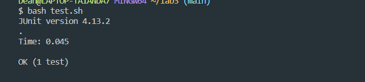

# Lab-Report5 - Putting it All Together

`part1: Debugging Scenario`

```
Subject: Issue with my Java Program

Hello,

I'm encountering an issue with the reverseInPlace method in my Java code.
The function is supposed to reverse the input array in-place, but it seems like there's a bug.
I've attached a screenshot of the problematic code below.

```
```
Error Code :
 // Changes the input array to be in reversed order
    static void reverseInPlace(int[] arr) {
        for (int i = 0; i < arr.length; i += 1) {
            arr[i] = arr[arr.length - i - 1];
        }
    }

```
```
Test Code :
 @Test
 public void testReverseInPlace() {
   int[] input1 = { 3, 4, 5, 6, 7 };
   ArrayExamples.reverseInPlace(input1);
   assertArrayEquals(new int[] { 7, 6, 5, 4, 3 }, input1);
 }
```

```
Description of the issue:
I suspect the issue is with the reverseInPlace method, but I can't quite figure out what's wrong. Any insights?
Thanks!
```
---

`2. A response from a TA asking a leading question or suggesting a command to try`

```
Hi there!

Thanks for reaching out. It looks like there might be an issue with your reverseInPlace method.
The logic you've shared seems to be modifying the array, but it might not be achieving the desired reversal.

Could you try replacing your reverseInPlace method with the following code and run your test again?
This code reverses the array by swapping elements up to the middle point. Give it a try and let me know how it goes!
```

```
Code:
  static void reverseInPlace(int[] arr) {
    for (int i = 0; i < arr.length / 2; i += 1) {
      int temp = arr[i];
      arr[i] = arr[arr.length - i - 1];
      arr[arr.length - i - 1] = temp;
    }
  }
```
---

`3.Another screenshot/terminal output showing what information the student got from trying that, and a clear description of what the bug is.`

```Hey,

I tried the updated code for reverseInPlace, and it worked! The array is now being reversed as expected.
The test passed successfully. Thanks a lot for your help! Any idea why the original code was causing issues?
```



---
4. Bug Description:
```
The original reverseInPlace method was incorrectly modifying the array, leading to unexpected results.
The corrected code swaps elements up to the middle point, ensuring a proper in-place reversal.
```

---
5.At the end, all the information needed about the setup including:
- `The file & directory structure needed`
```
lab3
 -lib
  - ArrayExamples.java
  - ArrayTests.java
  - test.sh
```

- The contents of each file before fixing the bug

`1.ArrayExamples.java`

```
static void reverseInPlace(int[] arr) {
  for(int i = 0; i < arr.length; i += 1) {
    arr[i] = arr[arr.length - i - 1];
  }
}
```
`2.ArrayTests.java`

```
@Test
public void testReverseInPlace() {
  int[] input1 = { 3, 4, 5, 6, 7 };
  ArrayExamples.reverseInPlace(input1);
  assertArrayEquals(new int[] { 7, 6, 5, 4, 3 }, input1);
}
```
`3.test.sh`

```
 javac -cp ".;lib/hamcrest-core-1.3.jar;lib/junit-4.13.2.jar" *.java
 java -cp ".;lib/junit-4.13.2.jar;lib/hamcrest-core-1.3.jar" org.junit.runner.JUnitCore ArrayTests
```
- The full command line (or lines) you ran to trigger the bug

`bash test.sh`

- `A description of what to edit to fix the bug:`
`In the ArrayUtils.java file, update the reverseInPlace method to correctly reverse the array using a proper swapping technique:`

```
  static void reverseInPlace(int[] arr) {
        for (int i = 0; i < arr.length / 2; i += 1) {
            int temp = arr[i];
            arr[i] = arr[arr.length - i - 1];
            arr[arr.length - i - 1] = temp;
        }
    }
```
`After making this change, recompile the code and run the test again using the same commands, and the test should pass successfully.`

---
